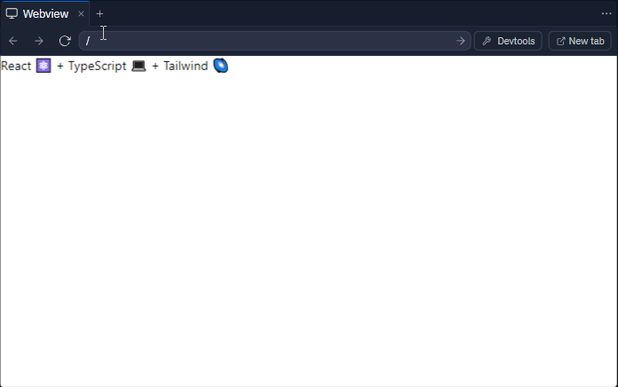
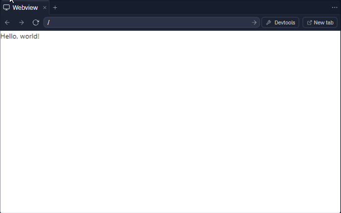
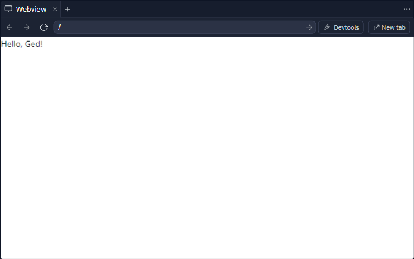
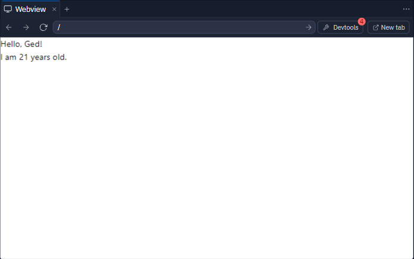
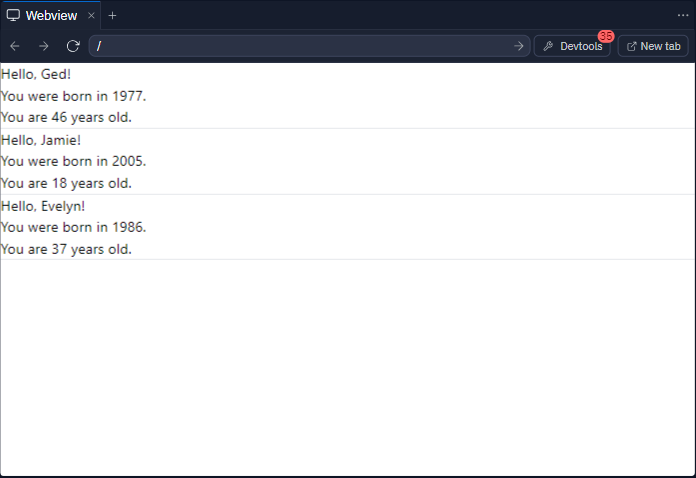
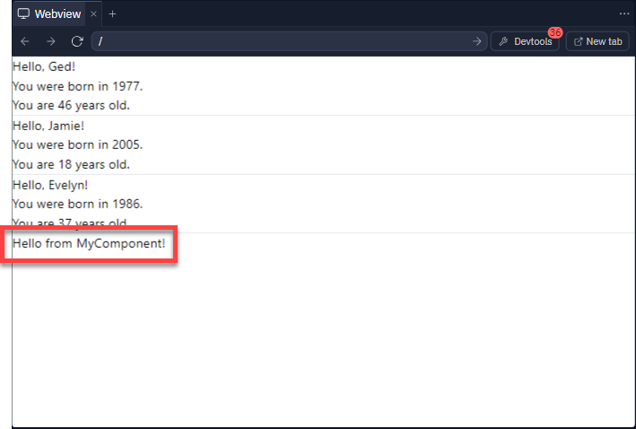
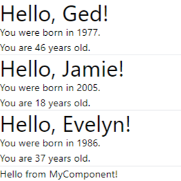

# Introduction to React and Tailwind: Building and Styling a Web Page

## Getting Started

In the project directory, you can run:

```bash
npm start
```

 - Runs the app in the development mode.
 - Open http://localhost:3000 to view it in the browser.

The page will reload if you make edits.
You will also see any lint errors in the console.

---

First, let's open [src/App.tsx](#src/App.tsx) and take a look at it's contents:

```jsx
export default function App() {
  return (
    <main>
      <h1>
        React ⚛️ + TypeScript 💻 + Tailwind 🌌
      </h1>
    </main>
  )
}
```

As you can see, this is normal a JavaScript function, but it seems to be `return`ing HTML! How does that work?!

Well, it's not actually HTML, but something called JSX. Let's take a minute to understand what this is.

> ## What is JSX?
> 
> JSX stands for **JavaScript XML**. It's a syntax extension for JavaScript that allows you to write HTML-like code inside your JavaScript. It's mainly used with React to describe what the UI should look like.
> 
> ### Why is JSX Useful?
> 
> Imagine you're building a website. Traditionally, you'd have separate files for your HTML (structure) and JavaScript (functionality). With JSX, you can seamlessly integrate the two, making it easier to connect your webpage's structure with its behavior.
> 
> ### Breaking Down JSX
> 
> 1. **Looks Like HTML, But It's Not**: At first glance, JSX might look exactly like HTML. But remember, it's not pure HTML. It's a blend of JavaScript and HTML.
> 
> 2. **Embed Expressions**: JSX allows you to embed JavaScript expressions within `{ }`. For example:
> 
>    ```jsx
>    const name = 'John';
>    const element = <h1>Hello, {name}</h1>;
>    ```
> 
>    Here, `{name}` is a JavaScript expression inside JSX.
> 
> 3. **Custom Components**: With JSX, you can also create and use custom components. These components can be thought of as custom HTML tags. For example:
> 
>    ```jsx
>    function Welcome({ name }) {
>      return <h1>Hello, {name}</h1>;
>    }
> 
>    const element = <Welcome name="Sarah" />;
>    ```
> 
>    Here, `<Welcome />` is a custom JSX tag (or component) we defined.
> 
> 4. **Attributes & Naming**: In JSX, you can use attributes just like in HTML. However, because it's JavaScript, some words like `class` are reserved. So, instead of `class`, you'd use `className`. Similarly, JSX uses camelCase property naming (e.g., `onclick` in HTML becomes `onClick` in JSX).
> 
> 5. **Self-closing Tags**: In JSX, if a tag doesn’t have any children, you can write it as a self-closing tag, like ``.
> 
> ### Not Magic, Just Syntactic Sugar!
> 
> Under the hood, JSX provides a set of instructions for React to create JavaScript objects from the given structure. It's like a shorthand. For example, this JSX:
> 
> ```jsx
> const element = <h1 className="greeting">Hello, world!</h1>;
> ```
> 
> is transformed into this JavaScript code:
> 
> ```javascript
> const element = React.createElement(
>   'h1',
>   {className: 'greeting'},
>   'Hello, world!'
> );
> ```
> 
> ### In Conclusion
> 
> Think of JSX as a tool that allows you to write your app's UI in a more intuitive and readable way. It combines the best parts of JavaScript and HTML, giving you the power to create dynamic content with a familiar syntax. And remember, while JSX is often used with React, understanding JSX on its own is a great step towards mastering React!

## Step 1: Update the `App` component

First, click the 'Run' button at the top of your screen.


After a few seconds, you should see a 'Webview' panel appear. It should look something like this:



Change the text inside the `<h1>` tags so that it reads 'Hello, world!' like so:

```jsx
export default function App() {
  return (
    <main>
      <h1>
        Hello, world!
      </h1>
    </main>
  )
}
```

After a moment, you should see your message appear in the Webview panel:



Congratulations! You've just written your first bit of React code!

## Step 2: Interpolate variables

Let's make use of some yummy scrummy JavaScript goodness.

Create a new `const` variable called `name` just below your `App` function's opening curly braces. Replace the value shown with your own name:

```js
export default function App() {
  const name = 'Ged'; // Replace with your own name

  return (
    <main>
      <h1>
        Hello, world!
      </h1>
    </main>
  )
}
```

Next, **interpolate** this variable with curly braces inside the JSX you are `return`ing at the end of the function:

```jsx
export default function App() {
  const name = 'Ged';

  return (
    <main>
      <h1>
        Hello, {name}!
      </h1>
    </main>
  )
}
```

After a moment, you should see the value of your `name` variable appear in the Webview panel:



### Expression slots

Think of these curly braces as **expression slots** inside the JSX. You can place any valid JavaScript expression in here and it will work.

Let's try this now. Add a second `const` variable immediately below your `name`:

```jsx
export default function App() {
  const name = 'Ged';
  const currentYear = new Date().getFullYear();

  return (
    <main>
      <h1>
        Hello, {name}!
      </h1>
    </main>
  )
}
```

Now, add a `<p>` tag below the `h1` tag with your `name` in it. Replace the second number - `2022` in this case - with the year you were born:

```js
export default function App() {
  const name = 'Ged';
  const currentYear = new Date().getFullYear();

  return (
    <main>
      <h1>
        Hello, {name}!
      </h1>
      <p>You are {currentYear - 1977} years old.</p>
    </main>
  )
}
```

You should see the result of this expression appear in your Webview component:



These 'expression slots' are incredibly useful in React, and make it really easy to update pages with dynamic data on the fly 😎.

## Step 3: Using `map` to loop through arrays

You might be used to looping through arrays using `for` loops in JavaScript, but React makes use of a new(ish) method called `map` that was introduced to the language a few years ago.

> ### Introducing `map`
>
> `map` is an in-built method that we can call on any existing array in JavaScript.
>
> It loops through all the elements in the array it is called on, then returns a _new_ array at the end containing the results of everything it did to the original. The original array is left completely untouched!
>
> For example, given the array below:
> ```js
> const numbers = [1, 2, 3];
> ```
> We could call `map` to double every number within it:
> ```js
> const numbers = [1, 2, 3];
> 
> const doubled = numbers.map(function(number) {
>   return number * 2;
> });
> // returns [2, 4, 6]
> ```
> As you can see, `map` takes a single argument of a function. This function repeatedly gets called back on every element in the array by `map`, so it is called a **callback function**.
>
> ### How to write a `map` callback function
> `map`'s callback function takes a parameter that represents the current element in the array being looped over. As with any function, we can call this parameter anything we like, so it makes sense in this instance to call it `number, as we are looping over an array of numbers.
>   
> In our example, the first time `number` is passed into `map`'s callback function, it has the value of `1`, as this is the first element of the `numbers` array:
> ```js
>   const numbers = [1, 2, 3];
> ```
> The callback function then `return`s the result of `1 * 2`, and this gets placed as the first element of a _new_ array that `map` is busily creating in the background.
>
> The `map` function then moves onto the second element in the array. In our example, this is the value `2`. `map` repeats the process again, assigning the parameter `number` to the value `2` this time, and calling the block of code inside the function once more. This continues until the end of the `numbers` array has been reached.
>
> Once `map` can't go any further, it then returns a new array:
> ```js
> const numbers = [1, 2, 3];
> const doubled = numbers.map(function(number) {
>   return number * 2;
> });
> // `doubled` now has a value of [2, 4, 6]
> ```
> ### Arrow functions
> We can write this callback function using a shorthand syntax:
> ```js
> const numbers = [1, 2, 3];
> 
> const doubled = numbers.map((number) => number * 2);
> // still returns [2, 4, 6]
> ```
> This is a perfectly valid way of writing a function in JavaScript. It is called an [arrow function](https://www.javascripttutorial.net/es6/javascript-arrow-function/) because of the shape made by the `=>` symbols.
>
> See how much quicker it is to write functions this way? Because it only contains one statement, we can get rid of the surrounding curly braces. We can also get rid of the `return` keyword because the result of `number * 2` is returned automatically.
> 
> Note that we can only get rid of these curly braces and the `return` keyword in arrow functions that have a single statement like the one above. If there was more than one statement then we would have to include these like so:
> ```js
> const numbers = [1, 2, 3];
> 
> const doubled = numbers.map((number) => {
>    console.log(`The current number is: ${number}`);
>  
>    return number * 2
>  });
> // still returns [2, 4, 6]
> ```

**Phew! OK - back to React 😅!**

Let's add an array of objects representing people at the top of our `App` component:

```jsx
export default function App() {
  const currentYear = new Date().getFullYear();
  const people = [
    { name: 'Ged', born: 2002 },
    { name: 'Jamie', born: 2005 },
    { name: 'Evelyn', born: 1986 }
  ];

  return (
    <main>
      <h1>
        Hello, {name}!
      </h1>
      <p>You are {currentYear - 1977} years old.</p>
    </main>
  )
}
```

Now we can call `map` on the `people` array in our JSX using an expression slot, and loop over every object inside it! Let's modify the markup we've already got and put it inside our callback function:

```jsx
export default function App() {
  const currentYear = new Date().getFullYear();
  const people = [
    { name: 'Ged', born: 1977 },
    { name: 'Jamie', born: 2005 },
    { name: 'Evelyn', born: 1986 }
  ];

  return (
    <main>
      {people.map((person) => {
        const age = currentYear - person.born;

        return (
          <div>
            <h1>
              Hello, {person.name}!
            </h1>
            <p>You were born in {person.born}.</p>
            <p>You are {age} years old.</p>
            <hr />
          </div>
        );
      })}
    </main>
  )
}
```

Check your Webview panel. You should be able to see something like this:



Nice! 😎

## Step 4: Custom React Components

Next, let's create a custom React component. We will call it `MyComponent`, and place it just above the existing code in [src/App.js](#src/App.js):

```javascript
function MyComponent() {
  return (
    <div>
      Hello from MyComponent!
    </div>
  );
}

export default function App() {
  const currentYear = new Date().getFullYear();

  // I've cut the rest of the code from this example, but keep it in your own!
}
```

## Step 5: Call `MyComponent` in `App`
Within the JSX, insert `<MyComponent />` just above your closing `</main>` tag like so:

```jsx
export default function App() {
  const currentYear = new Date().getFullYear();
  const people = [
    { name: 'Ged', born: 1977 },
    { name: 'Jamie', born: 2005 },
    { name: 'Evelyn', born: 1986 }
  ];

  return (
    <main>
      {people.map((person) => {
        const age = currentYear - person.born;

        return (
          <div>
            <h1>
              Hello, {person.name}!
            </h1>
            <p>You were born in {person.born}.</p>
            <p>You are {age} years old.</p>
            <hr />
          </div>
        );
      })}
      <MyComponent /> {/* This is where we import MyComponent */}
    </main>
  )
}
```

You should see the message from `MyComponent` appear in your Webview panel:



## Step 6: Style the `<h1>` tag with Tailwind
Add the `className` attribute to the `<h1>` tag with the value `"text-4xl"`:

```jsx
<h1 className="text-4xl">
  Hello, {person.name}!
</h1>
```

After a moment, your Webview panel should update:



`"text-4xl"` is a class name, and we've just applied our first TailwindCSS class. This is how we will style the elements on our web pages to make them look how we want.

Let's add some more TailwindCSS class names and see what they do:

```jsx
<h1 className="text-4xl font-bold text-center mt-10">
  Hello, {person.name}!
</h1>
```

See if you can understand the effect each class name has on the appearance of the text. Delete one to see what happens, then replace it back again. Head over to the [TailwindCSS docs page](https://tailwindcss.com/docs/installation) and paste each class name into the Search bar to see what it does:


## Step 7: Style the two Paragraphs with Tailwind
Style your paragraphs:

```jsx
  <p className="text-xl my-10 text-gray-600 text-center">You were born in {person.born}.</p>
  <p className="text-xl my-10 text-gray-600 text-center">You are {age} years old.</p>
```

## Step 8: Add a Button
After the paragraph, add a button element:

```jsx
<button>Click Me!</button>
```

## Step 10: Style the Button with Tailwind
Style the button:

```jsx
<button className="mt-5 p-2 bg-blue-500 text-white rounded hover:bg-blue-700 transition duration-300">Click Me!</button>
```

---

## Summary

With this tutorial, you have not only created and style a web page using React and Tailwind, but you've also learned how to structure your React app by importing components and images. Happy coding! 🚀
